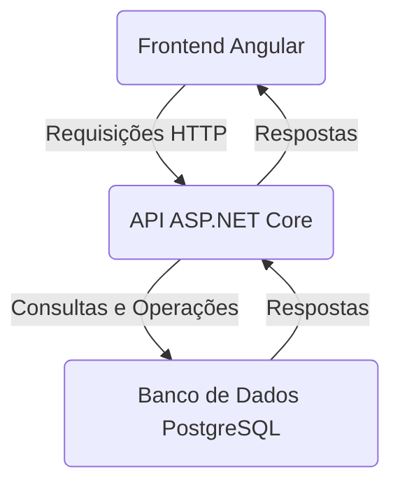
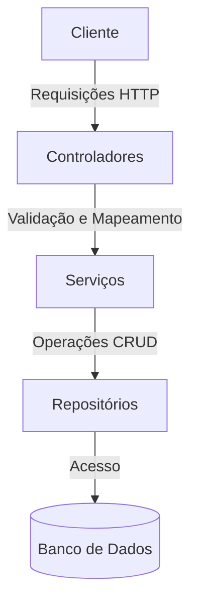

# Projeto Angular + .NET

## Rotas Utilizadas no Projeto

### API - AutorController
- `GET /api/autor` - Retorna todos os autores.
- `GET /api/autor/{id}` - Retorna um autor pelo ID.
- `POST /api/autor` - Adiciona um novo autor.
- `PUT /api/autor/{id}` - Atualiza um autor pelo ID.
- `DELETE /api/autor/{id}` - Remove um autor pelo ID.

### API - AssuntoController
- `GET /api/assunto` - Retorna todos os assuntos.
- `GET /api/assunto/{id}` - Retorna um assunto pelo ID.
- `POST /api/assunto` - Adiciona um novo assunto.
- `PUT /api/assunto/{id}` - Atualiza um assunto pelo ID.
- `DELETE /api/assunto/{id}` - Remove um assunto pelo ID.

### API - LivroController
- `GET /api/livro` - Retorna todos os livros.
- `GET /api/livro/{id}` - Retorna um livro pelo ID.
- `POST /api/livro` - Adiciona um novo livro.
- `PUT /api/livro/{id}` - Atualiza um livro pelo ID.
- `DELETE /api/livro/{id}` - Remove um livro pelo ID.
- `POST /api/livro/transaction` - Realiza uma transação de livro.
- `GET /api/livro/relatorio` - Retorna um relatório de livros.

### Frontend - Angular
- `/` - Redireciona para `/dashboard`.
- `/dashboard` - Página inicial do dashboard.
- `/gerenciamento` - Página de gerenciamento.

## Como Rodar o Projeto com Docker Compose

### Pré-requisitos
- Docker e Docker Compose instalados.

### Passos
1. Navegue até o diretório do projeto:
  
2. Execute o comando para iniciar os containers:
   ```bash
   docker-compose up --build 
   ```

3. Aguarde até que todos os serviços estejam em execução.

### Acessando os Serviços
- **Frontend (Angular):** Acesse `http://localhost:4200`.
- **API (ASP.NET Core):** Acesse `http://localhost:8080`.
- **Banco de Dados (PostgreSQL):** Porta `5432`.

### Versões Utilizadas
- **.NET:** 6.0
- **Angular:** 15
- **PostgreSQL:** Latest (confirmado no arquivo `docker-compose.yml`).

### Observação
Certifique-se de que as portas `4200`, `8080`, e `5432` estejam livres antes de iniciar o projeto.

## Fluxo do Projeto



## Fluxo da API



## Modelo do Banco de Dados


## Demonstração


